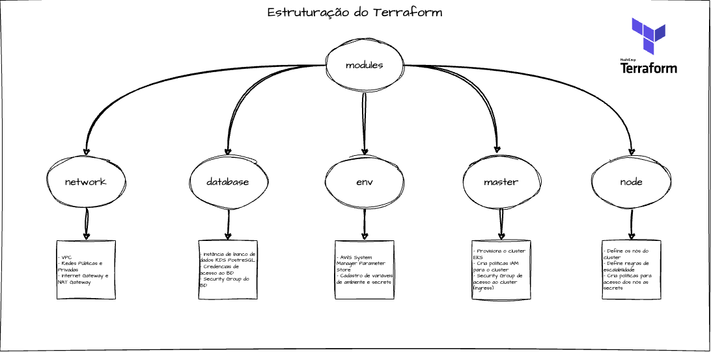
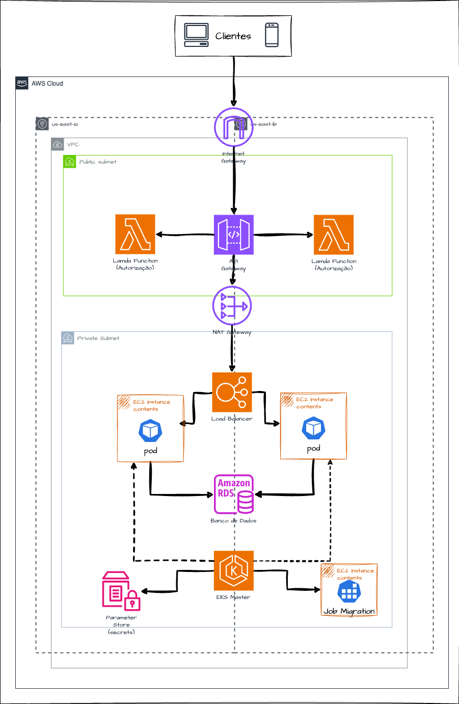
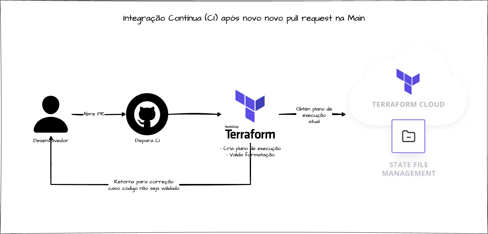
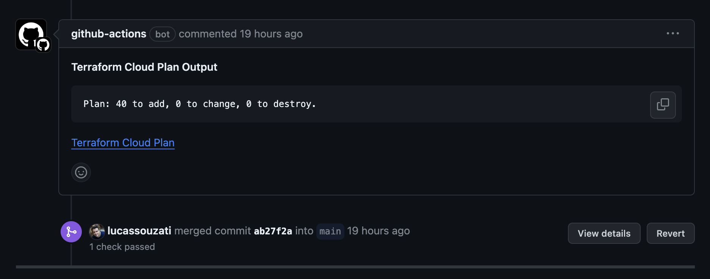
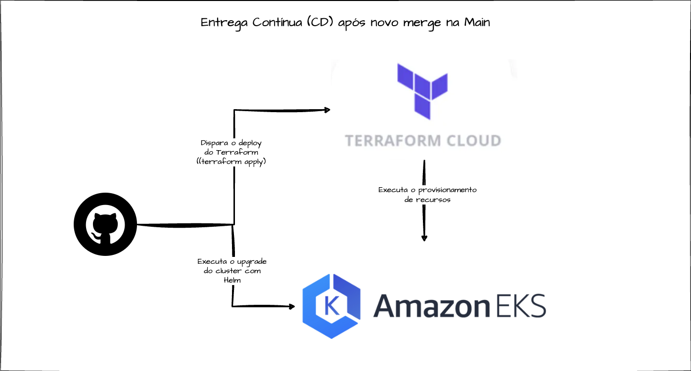

<h1 align="center">
    Hexaform
</h1>


## Índice

- <a href="#boat-sobre-o-projeto">Sobre o projeto</a>
- <a href="#hammer-tecnologias">Tecnologias</a>
- <a href="#rocket-como-rodar-esse-projeto">Como rodar esse projeto</a>
- <a href="#world_map-composição-do-terraform">Composição do Terraform</a>
- <a href="#globe_with_meridians-infraestrutura-na-aws">Infraestrutura na AWS</a>
- <a href="#globe_with_meridians-devops">DevOps
</a>
    - <a href="#proteção-da-branch-main">Proteção da branch main</a>
    - <a href="#integração-contínua-ci">Integração Contínua (CI)</a>
    - <a href="#entrega-contínua-cd">Entrega Contínua (CD)</a>
- <a href="#chart_with_upwards_trend-melhorias">Melhorias</a>
- <a href="#bookmark_tabs-licença">Licença</a>
- <a href="#wink-autores">Autores</a>
## :boat: Sobre o projeto

Esse projeto faz parte do trabalho "Tech Challenge - Fase 03", ministrado no terceiro módulo do curso de Pós Graduação Software Architecture da FIAP em parceria com a Alura.

Para exercitar os conceitos apresentados nas matérias do curso, sendo elas Desenvolvimento Serverless, Devops e Data Engineering, foi desenvolvildo esse projeto cujo objetivo é provisionar de forma automatizada toda infraestrutura necessária para execução em cloud do projeto [Hexafood](https://github.com/brpadilha/hexafood). 

## :hammer: Tecnologias:

- **[Terraform](https://www.terraform.io/)**
- **[Kubernetes](https://kubernetes.io/pt-br/)**
- **[Helm](https://helm.sh/)**
- **[EKS](https://aws.amazon.com/pt/eks/)**

## :rocket: Como rodar esse projeto

Considerando que você já possui AWS CLI, Terraform, Kubectl e Helm já instalados na sua máquina e configurados corretamente na sua conta AWS, basta clonar o repositório, acessar o diretório e executar:

```
terraform init
```

Neste momento, será criado um plano de execução e você poderá ver tudos recursos que serão alocados na AWS. Para executar o provisionamento: 

'''
terraform apply -auto-approve
'''

Este processo demorará alguns minutos. Depois concluído é necessário executar configurações adicionais e o provisionamento do próprio cluster kubernetes. Todos esses comandos foram compilados em um script sh, então basta executá-lo:
'''
./setup-k8sincloud.sh
'''

## :world_map: Composição do Terraform

O Terraform é uma ferramenta de software de infraestrutura como código criada pela HashiCorp. Os usuários definem e fornecem infraestrutura de data center usando uma linguagem de configuração declarativa conhecida como HashiCorp Configuration Language. 

Nesse projeto, foi escolhido trabalhar com AWS por familiriadade dos membros. O principal requisito era que aplicação estava provisionada em um cluster kubernetes, o que tornou necessário adoção de um serviço que seja equivalente na AWS, nesse caso o EKS (Elastic Kubernetes Service). 

Para aprovisionar um cluster kubernetes no EKS, é necessário algumas configurações prévias. A primeira dela é a criação de uma rede privada VPC (Virtual Private Cloud). Além disso, é necessário que as sub-redes dessa VPC estejam em múltiplas áreas de disponibilidade. Por isso foi criado duas subnets públicas e privadas. 

Também foi escolhido um banco de dados gerenciável pela própria AWS, no caso o RDS (Relational Database Service). Tal opção se justifica pela vantajosidade de delegar a manutenção da infraestrutura do banco de dados para própria AWS, enquanto podemos focar na infraestrutura da aplicação. 

Após o banco de dados ser provisionado pelo RDS, os dados de acesso são passados para outro recurso da AWS chamado AWS System Manager Parameter Store. Nele é possível o cadastro tanto de variáveis de ambiente como de secrets. Esses dados serão injetados nos pods do cluster kubernetes, para que eles se consigam se comunicar com o banco de dados.

Devido a complexidade da infraestrutura, foi adotado uma abordagem modular dos componentes do Terraform, visando a manutenbilidade do código e reaproveitamento de componentes. De forma resumida, a estrutura de Terraform deste projeto pode ser disposta dessa forma:
<br>
<h4 align="center">
    
</h4>
<br>

## :globe_with_meridians: Infraestrutura na AWS

Após o aprovisionamento correto da infraestrutura pela Terraform, temos a arquitetura completa da aplicação executando na AWS, conforme imagem a seguir:
<br>
<h4 align="center">
    
</h4>
<br>
Nesse diagrama, pode-ser ter uma visão mais clara de como funciona o fluxo de rede da infraestrutura na AWS. 

A rede interna é exposta na internet através do Internet Gateway. O primeiro contato é com as subnets públicas, onde estão alocados o API Gateway e a função lambda de autorização.

Depois da requisição estar autenticada pela função lambda, ela é direcionada as redes privadas, que por sua vez estão conectadas através de um NAT Gateway. 

Nesse momento, a requisição chega ao cluster EKS e o primeiro contato é com o Ingress do cluster, que nesse caso é provisionado um Application Load Balancer pela AWS. 

O Load Balancer então redireciona as requisições para os pods de acordo com as regras definidas no cluster. Já os pods,  possuem conexão com o banco de dados RDS que também está exposto nas redes privadas.

O master do cluster é onde possibilita a gestão do cluster bem como a execução de novos deploys. Ele também provisiona um job que é responsável pela execução das migrações do banco de dados. Além disso, ele faz a injeção da secrets e variáveis de ambientes nos pods.

Por último e não menos importante, pode-se notar que existem duas zonas disponibilidades no diagrama, sendo us-east-1 e us-east-2. Isso indica que todos esses recursos são alocados em duas zonas de disponibilidade, o que é requisito necessário tanto para o RKS para o RDS, por serem serviços de alta disponibilidade. Isso quer dizer que em caso de uma zona falhar, a outra pode continuar funcionando. 

## :globe_with_meridians: DevOps

Visando integrar boas práticas e cultura DevOps a este projeto, foram implantados as seguintes configurações neste projeto:

### Proteção da branch main

A branch main foi protegida a fim de as alterações nela sejam feitas apenas por Pull Requests, o que garante que apenas alterações revisadas e aprovadas estejam no código que seja provisionado em produção. 

### Integração Contínua (CI)

Cada novo pull request é submetido a uma validação pelo próprio Terraform através do Github Actions, o que facilita a revisião e aprovação de novas alterações. Esse fluxo pode ser visto na seguinte imagem:
<br>
<h4 align="center">
    
</h4>
<br>

Alem disso, o workflow de integração contínua retorna o plano de execução das alterações no estado do Terraform, conforme pode ser visto no exemplo a seguir:
<br>
<h4 align="center">
    
</h4>
<br>

### Entrega Contínua (CD)

Após acontecer um novo merge na main, é disparado um novo workflow do Github Actions responsável por execução do provisionamento do terraform na AWS. No mesmo workflow, é feito o deploy do cluster Kubernetes assim que o Terraform concluí a alocação de recursos, conforme pode ser visto na imagem a seguir:
<br>
<h4 align="center">
    
</h4>
<br>

## :chart_with_upwards_trend: Melhorias

Durante a implementação deste projeto, foi constatado oportunidades de melhorias que poderão vir a ser implementadas futuramente. Dentre elas pode-se destacar:

- Implementação de ferramentas de observalidade
- Adoção de estratégias de deploy como Deploy Blue-Green ou Canary
- Refatorações diversas nos workflows a fim de mitigar pontos de falha

## :bookmark_tabs: Licença

Este projeto esta sobe a licença MIT. Veja a [LICENÇA](https://opensource.org/licenses/MIT) para saber mais.

## :wink: Autores

Feito com ❤️ por:

- [Bruno Padilha](https://www.linkedin.com/in/brpadilha/)
- [Lucas Siqueira](https://www.linkedin.com/in/lucassouzatidev/)
- [Marayza Gonzaga](https://www.linkedin.com/in/marayza-gonzaga-7766251b1/)

[Voltar ao topo](#índice)

