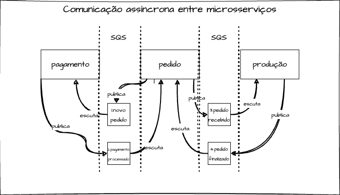

<h1 align="center">
    Hexaform
</h1>


## Índice

- <a href="#boat-sobre-o-projeto">Sobre o projeto</a>
- <a href="#hammer-tecnologias">Tecnologias</a>
- <a href="#rocket-como-rodar-esse-projeto">Como rodar esse projeto</a>
- <a href="#world_map-composição-do-terraform">Composição do Terraform</a>
- <a href="#globe_with_meridians-infraestrutura-na-aws">Infraestrutura na AWS</a>
- <a href="#globe_with_meridians-devops">DevOps</a>
    - <a href="#proteção-da-branch-main">Proteção da branch main</a>
    - <a href="#integração-contínua-ci">Integração Contínua (CI)</a>
    - <a href="#entrega-contínua-cd">Entrega Contínua (CD)</a>
- <a href="#chart_with_upwards_trend-melhorias">Melhorias</a>
- <a href="#bookmark_tabs-licença">Licença</a>
- <a href="#wink-autores">Autores</a>

## :boat: Sobre o projeto

Esse projeto faz parte do trabalho "Tech Challenge - Fase 04", ministrado no quarto módulo do curso de Pós Graduação Software Architecture da FIAP em parceria com a Alura.

Para exercitar os conceitos apresentados nas matérias do curso, sendo elas Estrutura de Microsserviços e Qualidade de Software, esse projeto foi atualizado a fim de abarcar os novos conteúdos. Dessa forma. o projeto foi dividido em 03 (três) microsserviços, sendo cada um deles com seus próprios testes unitários e aferição de cobertura de testes. 

As boas práticas das fases anteriores continuam sendo implementadas, como proteção da branch MAIN e utilização de pipelines CI/CD para execução de testes e automação de pipeline. Também foram realizadas adaptações para infraestrutura funcionar no AWS Academy disponibilizado pela FIAP, pois existe uma limitação quanto ao uso do IAM e todos serviços devem ser atribuído a role LabRole para operarem.

Nessa fase também tivemos a junção com outro grupo de trabalho, do qual aproveitou-se a funcionalidade de pagamento que estava melhor estruturada no trabalho desse grupo. Apesar de ser uma tecnologia diferente (Kotlin e Spring Boot), aproveitamos da vantagem de trabalhar com microsserviço que facilia a interoperalidade de sistemas em diferentes linguagem de programação.

## :hammer: Tecnologias:

- **[Terraform](https://www.terraform.io/)**
- **[Kubernetes](https://kubernetes.io/pt-br/)**
- **[Helm](https://helm.sh/)**
- **[EKS](https://aws.amazon.com/pt/eks/)**

## :rocket: Como rodar esse projeto

Considerando que você já possui AWS CLI, Terraform, Kubectl e Helm já instalados na sua máquina e configurados corretamente na sua conta AWS, basta clonar o repositório, acessar o diretório e executar:

```
terraform init
```

Neste momento, será criado um plano de execução e você poderá ver tudos recursos que serão alocados na AWS. Para executar o provisionamento: 

```
terraform apply -auto-approve
```

Este processo demorará alguns minutos. Depois concluído é necessário executar configurações adicionais e o provisionamento do próprio cluster kubernetes. Todos esses comandos foram compilados em um script sh, então basta executá-lo:
```
./setup-k8sincloud.sh
```

## :world_map: Composição do Terraform

O Terraform é uma ferramenta de software de infraestrutura como código criada pela HashiCorp. Os usuários definem e fornecem infraestrutura de data center usando uma linguagem de configuração declarativa conhecida como HashiCorp Configuration Language.

Dando continuidade a estrutura construída na fase anterior com EKS para provisão do cluster kubernetes, RDS para banco de dados e System Manager Store para cadastro de variáveis de ambiente e secrets, API Gateway e Lambda Function para autenticação das requisições, foi realizado a adição de novos recursos.

Como houve a quebra do monolito em três microsserviços, foi acrescentando o SQS (Simple Queue Service) para implementação da comunicação assíncronas entre os microsserviços. Além disso, foi acrescentado o ECR (Elastic Container Registry) para armazenamento das imagens dos containers de cada microsserviço.

Para atendimento de um requisitos do Tech Challenge, foi implementado um banco NoSQL para operação dos microsserviços, sendo escolhido o DynamoDB por facilidade de portabiliadde na AWS.

Dessa forma, o desenho da estrutura modular do Terraform atualizado fica da seguinte forma:
<br>
<h4 align="center">
    
</h4>
<br>

## :globe_with_meridians: Infraestrutura na AWS

Foi atualizado o desenho da arquitetura da infraestrutura na AWS, a fim de evidenciar a separação dos microsserviços:
<br>
<h4 align="center">
    
</h4>
<br>
Cada microsserviço passou a ser um deployment no cluster Kubernetes no EKS, com 2 réplicas e com seu próprio load balancer expondo as portas de acesso. A pipeline faz o deploy dos artefatos gerados (imagens docker) no ECR, sendo o EKS atualizar os pods para novas versões de imagem geradas no registry. Também é válido ressaltar que cada microsserviço tem o seu próprio banco de dados, garantindo assim independência total entre eles. 

O API Gateway adquire uma nova responsabilidade agora que é fazer o mapeamento de todos endpoints e redirecionar para o microsserviço correto. Dessa forma previne-se um acoplamento de um cenário onde por exemplo, um microsserviço precisar comunicar com outro, ele não precisar quem é o outro microsserviço. Dessa forma, nossa estrutura torna-se intercambiável.

## :globe_with_meridians: Comunicação assíncrona entre microsserviços

Para obter-se o ganho máximo de uma arquitetura de microsserviços, deve-se garantir sempre quando possível, a assincronidade na comunicação entre os componentes da arquitetura. Dessa forma, se um microsserviço precisa comunicar algum evento a outro, ele não pode depender de uma comunicação síncrona para isso, pois dessa forma criaríamos um forte acoplamento entre ambos, prejudicando a escabilidade do ecossistema. 

Por isso, os microsserviços foram configurados a se comunicarem através de eventos, onde a comunicação se dá majoriatriamente por filas SQS, conforme fluxo desenhado na figura a seguir:

<br>
<h4 align="center">
    
</h4>
<br>

Detalhando o diagrama, o microsserviço "pedido" continua como centralizador da regra de negócio, pois ele é o responsável por receber o pedido do cliente e também por avisar ao cliente que o pedido está pronto. O fluxo então funciona da seguinte forma:

1. Microsserviço pedido dispara o evento para fila "novo pedido";
2. Microsserviço pagamento escuta a fila "novo pedido", processa o pagamento e dispara outro evento pra fila "pagamento processado";
3. O microsserviço pedido escuta a fila "pagamento processado", e o pagamento sendo aceito, ele dispara outro evento pra fila "pedido recebido";
4. O microsserviço produção escuta a fila "pedido recebido" e os coloca na fila de produção
5. Quanto o pedido é finalizado, o micro servico produção deve disparar um evento "pedido finalizado""
6. O microsserviço atualiza o "pedido finalizado" através da fila e comunica ao cliente, encerrando assim o fluxo. 

## :chart_with_upwards_trend: Melhorias

Durante a implementação deste projeto, foi constatado oportunidades de melhorias que poderão vir a ser implementadas futuramente. Dentre elas pode-se destacar:

- Implementação de ferramentas de observalidade
- Adoção de estratégias de deploy como Deploy Blue-Green ou Canary
- Refatorações diversas nos workflows a fim de mitigar pontos de falha

## :bookmark_tabs: Licença

Este projeto esta sobe a licença MIT. Veja a [LICENÇA](https://opensource.org/licenses/MIT) para saber mais.

## :wink: Autores

Feito com ❤️ por:

- [Bruno Padilha](https://www.linkedin.com/in/brpadilha/)
- [Lucas Siqueira](https://www.linkedin.com/in/lucassouzatidev/)
- [Marayza Gonzaga](https://www.linkedin.com/in/marayza-gonzaga-7766251b1/)

[Voltar ao topo](#índice)

